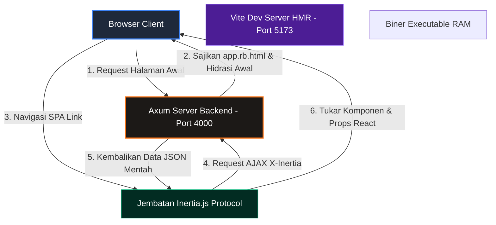

# 🏛️ RustBasic Architecture (SPA Edition)

Dokumen ini membedah arsitektur dasar dari framework **RustBasic Modern SPA** dan bagaimana komponen-komponennya berinteraksi secara mulus antara backend Rust (Axum) dan frontend JavaScript (React.js + Inertia.js).

---

## 1. Delegasi CLI & Starter Kit
RustBasic memisahkan tanggung jawab antara alat global dan kode lokal proyek untuk menjaga efisiensi:
*   **Global CLI (`rustbasic-cli`)**: Dikelola secara global (terinstal via `cargo install`). CLI global bertugas memicu pembuatan proyek baru (`new`), perakitan modul baru, dan pendelegasian perintah lokal.
*   **Local CLI (`src/main.rs` & `rustbasic-core`)**: Perintah CLI lokal seperti migrasi database (`migrate`), refresh skema (`migrate:refresh`), dan seeder data (`db:seed`) dijalankan langsung oleh kode proyek lokal melalui pendelegasian wrapper cargo.

---

## 2. Arsitektur Monolith SPA Terpadu

Berbeda dengan arsitektur web tradisional yang memisahkan frontend (port 3000) dan backend API (port 8000), RustBasic menyatukan keduanya menjadi **satu kesatuan monolith utuh (Single Port & Single Binary Deployment)**:



1.  **Hydration Awal**: Saat pengguna pertama kali membuka situs web, Axum merender template root [`app.rb.html`](file:///Users/herisvanhendra/Desktop/Desktop%20new/project/belajar%20rust/rustbasic/src/resources/views/app.rb.html) dengan objek JSON halaman awal yang disimpan pada atribut `'data-page'`. React SPA kemudian bangkit dan menghidrasi DOM browser secara instan.
2.  **Navigasi SPA Tanpa Reload**: Ketika pengguna menavigasi rute (misal mengklik `<Link href="/about">`), Inertia memotong request standar dan mengirim request AJAX khusus. Backend Axum secara cerdas **hanya mengembalikan data JSON mentah** berisi properti (*props*) terbaru. Halaman React langsung dirender ulang secara instan tanpa ada round-trip reload browser!

---

## 3. Web Routes vs API Routes
Pemisahan rute tetap dipertahankan untuk mengoptimalkan keamanan:
*   **Web Routes ([`src/routes/web.rs`](file:///Users/herisvanhendra/Desktop/Desktop%20new/project/belajar%20rust/rustbasic/src/routes/web.rs))**: Menyajikan halaman SPA Inertia. Dilengkapi dengan proteksi keamanan **CSRF** otomatis, session terenkripsi di HTTP-only cookie, dan CSP Headers yang aman.
*   **API Routes (`src/routes/api.rs`)**: Menyajikan data JSON murni untuk aplikasi pihak ketiga (pihak eksternal). Dilengkapi dengan CORS middleware dan bypass proteksi CSRF.

---

## 4. Inertia Shared Page Props (Penyuntik Data Global)
Di arsitektur Jinja lama, data global disuntikkan ke template engine. Pada edisi SPA, RustBasic menyuntikkan data global ini secara otomatis ke dalam **Shared Page Props** di setiap respons Inertia:

Setiap kali controller Axum mengembalikan respons `inertia()`, data berikut **otomatis ikut terkirim di dalam payload**:
*   `auth.user`: Objek data pengguna yang sedang login (ID, username, email, roles).
*   `errors`: Objek daftar pesan kesalahan validasi dari input formulir.
*   `flash.success` / `flash.error`: Pesan flash notifikasi satu-kali yang dikirim dari server.

Data global ini dapat diakses secara instan di komponen React mana pun dengan menggunakan hook bawaan:
```jsx
import { usePage } from '@inertiajs/react';

const { auth, flash, errors } = usePage().props;
```

---

## 5. Security & Middleware Stack
Setiap request yang masuk melalui web router diproses secara runut oleh middleware:
1.  **Request Logging**: Melacak status respon dan durasi request.
2.  **Session & CSRF**: Menangani dekripsi cookie sesi dan verifikasi keabsahan token request.
3.  **Inertia Context Builder**: Membaca sesi, memetakan flash message, dan menyusun Shared Props global.
4.  **Application Logic (Controller)**: Menjalankan logika bisnis Anda dan merender komponen React SPA yang sesuai.
